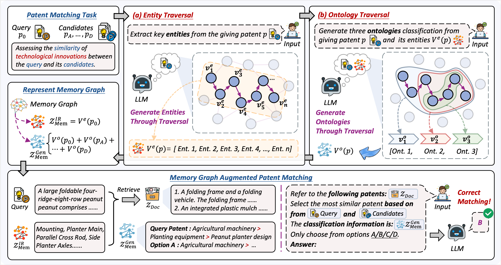

I'm Qiushi Xiong (熊秋实), a second-year M.S. student in Artificial Intelligence at Northeastern University. I am fortunate to be advised by Associate Professor [Zhenghao Liu](https://edwardzh.github.io/). Currently, I am doing a research internship at [Alibaba Group](https://ali-home.alibaba.com/). My research interests focus on information retrieval and retrieval-augmented generation.

# 💻 Internships
- *2024.04 - Present*, Enterprise Intelligence (EI), Alibaba Group, Hangzhou, China.

# 🔥 News
- *2025.04*: 🎉 Our work **"Enhancing the Patent Matching Capability of Large Language Models via the Memory Graph"** has been accepted by **SIGIR 2025**!

# 📝 Publications

  
  

    
  

  

    

      (CCF-A) SIGIR 2025
    

    <h3 style="margin: 10px 0 10px 0;">Enhancing the Patent Matching Capability of Large Language Models via the Memory Graph</h3>
    

      Qiushi Xiong, Zhipeng Xu, Zhenghao Liu, Mengjia Wang, Zulong Chen, Yue Sun, Yu Gu, Xiaohua Li, Ge Yu
    

    <a href="https://arxiv.org/abs/2504.14845" target="_blank" style="color: #1a73e8; text-decoration: none; font-weight: bold;">[Paper Link]</a>
  

