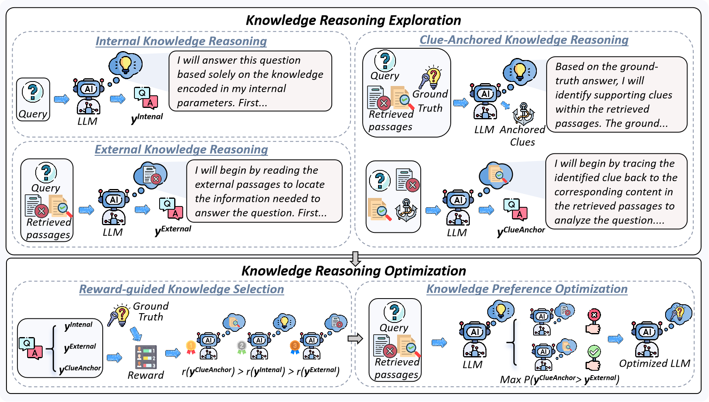

I'm Qiushi Xiong (熊秋实), a second-year M.S. student in Artificial Intelligence at Northeastern University. I am fortunate to be advised by Associate Professor [Zhenghao Liu](https://edwardzh.github.io/). Currently, I am doing a research internship at [Alibaba Group](https://ali-home.alibaba.com/) under the guidance of [Zulong Chen](https://scholar.google.com/citations?user=nUVmSqUAAAAJ&hl=zh-CN). My research interests focus on information retrieval and retrieval-augmented generation.

# 💻 Internships
- *2024.04 - Present*, Enterprise Intelligence (EI), Alibaba Group, Hangzhou, China.

# 🔥 News
- *2025.04*: 🎉 Our work **"Enhancing the Patent Matching Capability of Large Language Models via the Memory Graph"** has been accepted by **SIGIR 2025**!

# 📝 Publications

  

    
  

  

    

      Enhancing the Patent Matching Capability of Large Language Models via the Memory Graph
    

    

      <strong>Qiushi Xiong</strong>, Zhipeng Xu, Zhenghao Liu, Mengjia Wang, Zulong Chen, Yue Sun, Yu Gu, Xiaohua Li, Ge Yu
       Accepted by SIGIR 2025
      ✦ Oral Presentation
    

    

      CCF-A
    

    

      <a href="https://arxiv.org/abs/2504.14845" target="_blank" style="color: #1a73e8; text-decoration: none; font-weight: bold; font-size: 14px; margin-right: 16px;">[Paper Link]</a>
      <a href="https://github.com/neuir/memgraph" target="_blank" style="color: #1a73e8; text-decoration: none; font-weight: bold; font-size: 14px;">[Code]</a>
    

  

  

    
  

  

    

      ConsRec: Denoising Sequential Recommendation through User-Consistent Preference Modeling
    

    

      Haidong Xin, <strong>Qiushi Xiong</strong>, Zhenghao Liu, Sen Mei, Yukun Yan, Shi Yu, Shuo Wang, Yu Gu, Ge Yu, Chenyan Xiong
    

    

      Preprint
    

    

      <a href="https://arxiv.org/abs/2505.22130" target="_blank" style="color: #1a73e8; text-decoration: none; font-weight: bold; font-size: 14px; margin-right: 16px;">[Paper Link]</a>
      <a href="https://github.com/NEUIR/ConsRec" target="_blank" style="color: #1a73e8; text-decoration: none; font-weight: bold; font-size: 14px;">[Code]</a>
    

  

  

    
  

  

    

      HIPPO: Enhancing the Table Understanding Capability of Large Language Models through Hybrid-Modal Preference Optimization
    

    

      Zhenghao Liu, Haolan Wang, Xinze Li, <strong>Qiushi Xiong</strong>, Xiaocui Yang, Yu Gu, Yukun Yan, Qi Shi, Fangfang Li, Ge Yu, Maosong Sun
    

    

      Preprint
    

    

      <a href="https://arxiv.org/abs/2502.17315" target="_blank" style="color: #1a73e8; text-decoration: none; font-weight: bold; font-size: 14px; margin-right: 16px;">[Paper Link]</a>
      <a href="https://github.com/NEUIR/HIPPO" target="_blank" style="color: #1a73e8; text-decoration: none; font-weight: bold; font-size: 14px;">[Code]</a>
    

  

  

    
  

  

    

      ClueAnchor: Clue-Anchored Knowledge Reasoning Exploration and Optimization for Retrieval-Augmented Generation
    

    

      Hao Chen, Yukun Yan, Sen Mei, Wanxiang Che, Zhenghao Liu, Qi Shi, Xinze Li, Yuchun Fan, Pengcheng Huang, <strong>Qiushi Xiong</strong>, Zhiyuan Liu, Maosong Sun
    

    

      Preprint
    

    

      <a href="https://arxiv.org/abs/2505.24388" target="_blank" style="color: #1a73e8; text-decoration: none; font-weight: bold; font-size: 14px; margin-right: 16px;">[Paper Link]</a>
      <a href="https://github.com/thunlp/ClueAnchor" target="_blank" style="color: #1a73e8; text-decoration: none; font-weight: bold; font-size: 14px;">[Code]</a>
    

  

# 🎖 Honors and Awards

- *2023.09*: First-Class Graduate Scholarship, Northeastern University
- *2021.10*: National Scholarship, Ministry of Education of the People's Republic of China  
